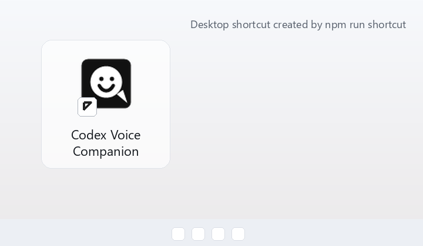

# Codex with Voice

Codex with Voice is a friendly local desktop wrapper, not a built-in Codex feature: say "codex" to send spoken requests to Codex CLI and hear a brief spoken reply.


## Install

Requirements:

- Windows 10 or Windows 11
- Node.js and npm
- Python 3.11
- Git
- Codex CLI installed and logged in
- A working microphone

Clone and install:

```cmd
git clone https://github.com/LizzieLee911/Codex-with-voice.git
cd Codex-with-voice

cd codex-voice-wlk
git clone https://github.com/QuentinFuxa/WhisperLiveKit.git
py -3.11 -m venv .venv
.venv\Scripts\python.exe -m pip install --upgrade pip
.venv\Scripts\python.exe -m pip install -e ".\WhisperLiveKit[listen]"

cd ..\codex-voice-desktop
npm install
```

## Launch

Run from source:

```cmd
cd codex-voice-desktop
npm start
```

Build a local portable app:

```cmd
cd codex-voice-desktop
npm run dist:portable
npm run shortcut
```

Then open the desktop shortcut or `dist\Codex Voice Companion.exe`. The app icon lives at `codex-voice-desktop\assets\app-icon.ico`; replace that file if you want a different logo.



Click `Start`, say "codex", then speak your request. `One-time` mode uses `codex exec` and speaks the result. `Interactive` mode opens a Codex task and speaks only the handoff status. When the Codex window is visible, a small smile bubble follows it and can start or stop listening. Closing the main window hides it to the tray; use the tray menu to show, start, stop, or quit.

## Troubleshooting

- If Windows blocks or deletes the app, restore it only if you built it from this repo, then allowlist the generated exe. The app is unsigned.
- If the app cannot find the voice bridge, set `CODEX_VOICE_ROOT` to the full `codex-voice-wlk` folder and restart the app.
- If listening never starts, check microphone permission and run `npm run smoke:bridge` from `codex-voice-desktop`.
- If WhisperLiveKit is stuck, stop old `wlk.exe` processes and start the app again.
- If speech output is wrong or silent, check the installed Windows voices and default audio output.
- The portable app is currently a local launcher, not a full installer for Python, CUDA, WhisperLiveKit, or model caches.
