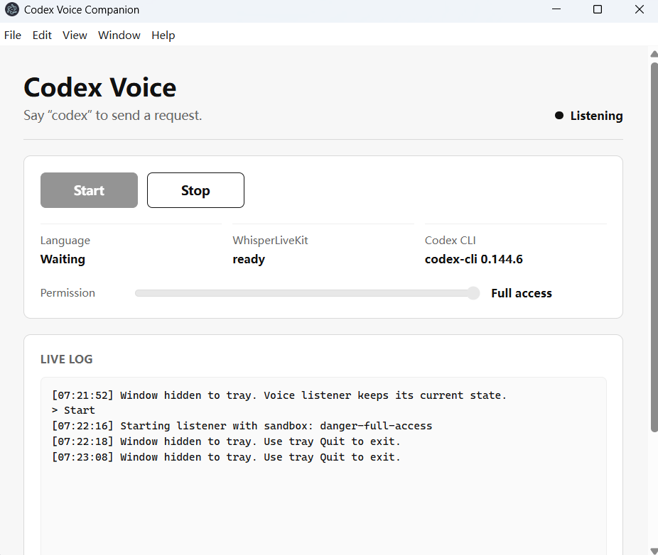

# Just hand this repo to Codex and it will handle everything for you. 

I actually don't think a readme is needed. The Desktop app should be straight forward enough



# Codex with Voice

Minimal desktop voice control for Codex CLI.

This project lets you keep a small desktop app running in the tray, say a wake word, speak a request, and send the transcribed text to Codex CLI. It uses WhisperLiveKit for local speech-to-text, a Python bridge for wake-word and endpoint detection, and an Electron desktop shell for Start/Stop, logs, tray behavior, and Codex permission mode selection.

The current build is a Windows-first prototype. macOS and Linux should be possible later, but the local text-to-speech and `.cmd` helper scripts are currently Windows-oriented.

## What It Does

- Listens for the wake word `codex`.
- Streams microphone audio to WhisperLiveKit.
- Uses local Silero VAD plus transcript stability to decide when the user has stopped speaking.
- Sends the final transcript to Codex CLI.
- Speaks a quick acknowledgement before Codex starts working.
- Speaks the final Codex answer with local Windows TTS.
- Can keep listening while the window is hidden to the system tray.
- Exposes a permission slider for Codex sandbox mode:
  - `read-only`
  - `workspace-write`
  - `danger-full-access`

## Repository Layout

```text
codex-voice-desktop/   Electron tray app
codex-voice-wlk/       Python voice bridge and WhisperLiveKit launcher scripts
```

WhisperLiveKit itself is not vendored in this repository. Install it into:

```text
codex-voice-wlk/WhisperLiveKit/
```

The Python virtual environment is also local-only:

```text
codex-voice-wlk/.venv/
```

Both are ignored by git.

## Requirements

- Windows 10 or Windows 11.
- Node.js and npm.
- Python 3.11 is recommended.
- Git.
- A working microphone.
- Codex CLI installed and logged in.
- Optional but recommended: NVIDIA GPU with CUDA for faster local STT.

Install Codex CLI if needed:

```cmd
npm install --global @openai/codex
codex --version
```

## Setup

Clone this repository:

```cmd
git clone https://github.com/LizzieLee911/Codex-with-voice.git
cd Codex-with-voice
```

Install WhisperLiveKit and the Python bridge environment:

```cmd
cd codex-voice-wlk
git clone https://github.com/QuentinFuxa/WhisperLiveKit.git
py -3.11 -m venv .venv
.venv\Scripts\python.exe -m pip install --upgrade pip
.venv\Scripts\python.exe -m pip install -e ".\WhisperLiveKit[listen]"
```

Install the desktop app dependencies:

```cmd
cd ..\codex-voice-desktop
npm install
npm run smoke
```

Start the desktop app:

```cmd
npm start
```

## Use The Desktop App

1. Open the app with `npm start`.
2. Pick the Codex permission mode before starting.
3. Click `Start`.
4. Say `codex`, then speak your request.
5. Wait for the spoken acknowledgement: `Sure, request received. Please hold on.`
6. Codex runs in the background and speaks the result.

Window behavior:

- Minimize hides the window to the tray.
- Closing the window also hides it to the tray.
- The listener keeps its current state while hidden.
- Click the tray icon to show the window again.
- Use tray `Quit` to stop the listener and exit the app.

## Manual Voice Bridge

You can run the STT server and bridge without the Electron app.

Start WhisperLiveKit:

```cmd
cd codex-voice-wlk
start_wlk_faster_whisper.cmd
```

Run the bridge in Codex mode:

```cmd
run_voice_bridge_codex.cmd
```

Run the bridge in preview mode, without sending anything to Codex:

```cmd
run_voice_bridge_preview.cmd
```

Stop the local WhisperLiveKit process started by the helper script:

```cmd
stop_wlk.cmd
```

## Codex Permission Modes

The desktop app defaults to `danger-full-access`, because this prototype is intended to let voice requests operate like normal local Codex CLI work.

Use this carefully. In full-access mode, Codex can run without filesystem sandbox boundaries. Switch to `workspace-write` or `read-only` before pressing `Start` if you want safer behavior.

The Python bridge exposes the same setting:

```cmd
.venv\Scripts\python.exe voice_bridge.py --submit-codex --speak --codex-sandbox workspace-write
```

## Current Limitations

- Windows-first prototype.
- Local STT runs before wake-word detection, so idle resource use is not yet minimal.
- Listening pauses while the synchronous Codex CLI call is running.
- TTS uses local Windows voices, so voice quality depends on installed system voices.
- The default STT model is `large-v3-turbo`; use a smaller WhisperLiveKit model if your machine is memory constrained.

## Smoke Tests

Desktop fake-Codex smoke test:

```cmd
cd codex-voice-desktop
npm run smoke
```

Real Codex CLI smoke test:

```cmd
npm run smoke:real
```
